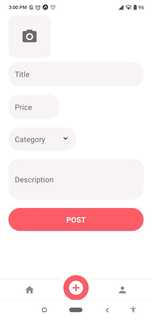

# found-4-u
A marketplace for the stuff you don’t need anymore, built with React Native
A cross-platform app build with React Native.
It can run in Android and IOS.

           

#### Features
- basic authentication
- Post method implementation, submit a form
- Get method implementation, display list of products
- Fetch data from API
- Animations
- run in Android and IOS devices

-----------------------------------------------

In the project directory, you can run:

### `npm start`

Runs the app in the development mode. 

-----------------------------------------------

In the project directory to start the backend server (https://github.com/Amisha-here/found-4-u-backend), you can run:

### `npm i`

Installs all the node modules. 

### `node index.js`

Starts the server at 9000 port. 

You can verify using http://localhost:9000/api/listings  

